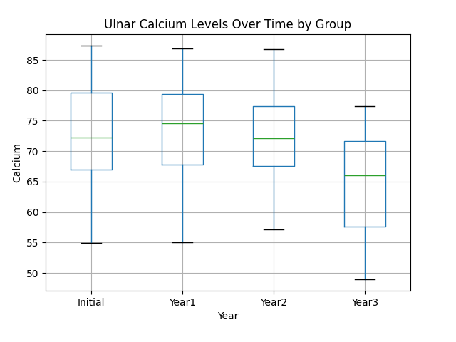



## Busiest Airports Analysis:

In this section, we wanted to analyze the a select few airports from the 
"List of busiest airports by passenger traffic" 2025 wiki data set. These include
the following airports:

1. Hartsfield–Jackson Atlanta International Airport
2. Indira Gandhi International Airport
3. Frankfurt Airport
4. Hong Kong International Airport
5. Beijing Daxing International Airport
6. Toronto Pearson International Airport

These were selected at random from the [original data set](https://en.wikipedia.org/wiki/List_of_busiest_airports_by_passenger_traffic).

Firstly, we took the data set and wrangled it such that it could be implemented
into a data table and visualization of our choice. We then took the data and 
formed it into a data table and visualization such that we can perform analysis
on these figures/tables. See @tbl-airportTable and @fig-airportGraphic below.

#### Analysis:

@fig-airportGraphic highlights scale and ranking, showing that Hartsfield-Jackson Atlanta International Airport operates at a much higher passenger volume than the others, exceeding 100 million travelers. This visual dominance makes it clear that Atlanta functions as a major global hub, likely due to its geographic positioning and role in domestic and international connections. However, @tbl-airportTable adds more context that the graph cannot fully convey. For example, while Indira Gandhi International Airport ranks second in this subset by passenger count, the table shows a slight decline in rank (-2) and minimal growth (+0.2%), suggesting stabilization rather than rapid expansion. In contrast, Hong Kong International Airport stands out not just for its passenger volume but for its significant growth (+14.9%) and jump in rank (+8). This indicates a strong recovery or expansion phase, which the graph alone would not reveal. Similarly, Beijing Daxing International Airport shows moderate passenger numbers but notable upward momentum (+3 rank change, +8.4% growth). This suggests it is an emerging hub gaining importance, even if it hasn’t yet reached the scale of the top airports. Meanwhile, Toronto Pearson International Airport appears at the lower end in both the graph and table, but its relatively stable metrics (+0.5% growth, slight rank drop) indicate consistency rather than decline.

```{r}
#| echo: false
#| message: false
#| warning: false
#| label: wrangleAirportData

# Wrangle Busiest Airports 2025 Data ----
## Wrangle the Busiest Airports 2025 Data such that we have a tidy version of the data
## that consists of 6 different airports. A case is an individual airport.

# Step 1: Load Packages ----
## Needed Packages: tidyverse, dplyr, rvest
library(rvest)
library(tidyverse)
library(dplyr)

# Step 2: Load Data ----
## Needed data: Busiest Airports 2025 Data using read_html
## We will set this to Airport2025Raw

## Step 2a: Read wiki page
airport_webpage <- read_html("https://en.wikipedia.org/wiki/List_of_busiest_airports_by_passenger_traffic#2025_statistics")

## Step 2b: Create table from wiki page
airport_all_tables <- html_table(airport_webpage, fill = TRUE)

## Step 2c: Extract 2025 Statistics table from "List of busiest airports by passenger traffic" wiki page
Airport2025Raw <- airport_all_tables[[1]]

# Step 4: Clean Airport2025Raw ----
Airport2025Cleaned <- Airport2025Raw |>
  ## Step 4A: Filter to get 6 airports we want
  filter(Rank %in% c(1, 11, 21, 24, 35, 49)) |>
  ## Step 4B: Rename columns
  rename(
    rank = 1,
    airport = 2,
    location = 3,
    country = 4,
    code_IATA_code_ICAO = 5,
    total_passengers = 6,
    rank_change = 7,
    percent_change = 8
  ) |>
  ## Step 4C: Separate IATA and ICAO code column
  separate_wider_delim(
    code_IATA_code_ICAO, delim  = "/", names = c("code_IATA", "code_ICAO")
  ) |>
  ## Step 4D: Separate city and region/state column
  separate_wider_delim(
    location, delim  = ", ", names = c("city", "region_state")
  ) |>
  ## Step 4E: Clean up numerics, change NA values to 0, get rid of % symbols and []
  mutate(
    percent_change = parse_number(percent_change),
    total_passengers = parse_number(total_passengers),
    rank_change = coalesce(rank_change, 0)
  ) |>
  ## Step 4F: Fix rank_change and percent_change such that they match a positive change or negative change
  mutate(
    rank_change = replace(rank_change, c(2, 6), -rank_change[c(2, 6)]),
    percent_change = replace(percent_change, 1, -1.6)
  )

```

```{r}
#| echo: false
#| message: false
#| warning: false
#| label: tbl-airportTable
#| tbl-cap: "6 Busy Airports from 'List of busiest airports by passenger traffic' dataset"
#| tbl-pos: H

##### Create Table: --------

# Load packages
library(dplyr)
library(scales)
library(knitr)
library(kableExtra)

# Clean Data Table Visualization of Airport Data
Airport2025Cleaned |>
  # Change total_passengers numeric into comma separated numbers
  mutate(total_passengers = comma(total_passengers)) |>
  # Give title and extra info, make it look pretty
  kable(
    format = "latex",
    align = "lcccccclll",
    col.names = c(
      "Rank",
      "Airport",
      "City",
      "Region/State",
      "Country",
      "IATA Code",
      "ICAO Code",
      "Total Passengers",
      "Rank Change",
      "Percent Change"
    )
  ) |>
  # Give table a theme
  kable_classic(
    lightable_options = "striped"
  ) |>
  kable_styling(
    latex_options = "scale_down"
  )

```

```{r}
#| echo: false
#| message: false
#| warning: false
#| label: fig-airportGraphic
#| fig-width: 7
#| fig-height: 4
#| fig-pos: H
#| fig-cap: "Airports by Passenger Traffic Count in 2025"
#| fig-cap-location: top
#| fig-alt: "Horizontal Bar Graph showing 6 airports and their total passenger traffic in 2025 from highest at the top to the lowest."

##### Create Visualization: --------

# Load Packages
library(ggplot2)
library(dplyr)
library(scales)

# Create Horizontal Bar Graph Visualization
Airport2025Cleaned |>
  ggplot(
    # Map data onto graph (order by number of passengers)
    mapping = aes(y = reorder(airport, total_passengers), x = total_passengers)
  ) +
  # Bar Graph
  geom_col() +
  # Make y scale comma separated numeric instead of in scientific notation
  scale_x_continuous(labels = comma) +
  # Label the graph
  labs(
    caption = "Select Sample of 6 airports from 'List of busiest airports by passenger traffic' dataset",
    x = "Airport",
    y = "Total Passengers"
  ) +
  theme_bw()

```



## Monte Carlo Numerical Integration:

In this section, we asked to create and analyze a visualization the Monte Carlo Numerical Integration process. This process is a way in which we can determine the integral of a function in a specified range. We then run the Monte Carlo Simulation we created 4 times, each time with a larger sample size than the previous and analyze the final visualization of the Sim.

#### How Monte Carlo Integration Works:

Monte Carlo integration can estimate an integral by sampling random points in a bounding rectangle around the function. Points are drawn uniformly over the rectangle, and we count how many fall below the curve.

The proportion of points below the curve approximates the fraction of the rectangle’s area that lies under the function:

$$
\text{Integral} \approx \text{Area of rectangle} * \frac{\text{\# of points below the curve}}{n}
$$

where the points are sampled uniformly over the rectangle.

Below is our final visualization of the 4 simulations of Monte Carlo Integration.

#### Analysis:

@fig-monteCarloSim shows how Monte Carlo integration improves as the sample size increases. With a very small sample n = 10, the estimate has a large variance, which is very inaccurate because the random points don’t represent the area under the curve well as there are so little. As the number of samples increases, the points become more evenly distributed, and the proportion of points under the curve stabilizes. This leads to estimates that are more accurate and more consistent.

By the time we reach n = 10,000, the estimate is approximately 1, which strongly suggests that the true value of the integral is approximately 1. The two previous plots of n = 100 and n = 1000 convergence of estimates close to 1 supports this reasoning, since they begin to cluster tightly around 1 as randomness averages out.

What helps someone else arrive at this conclusion is the visible stabilization of the green region relative to the total area. As the number of points increases, the ratio of green points to total points becomes consistent, showing that the estimate is converging to the true integral value.

```{r}
#| echo: false
#| message: false
#| warning: false
#| label: fig-monteCarloSim
#| fig-width: 7
#| fig-height: 6
#| fig-pos: H
#| fig-cap: "Monte Carlo Integration Simulation"
#| fig-cap-location: top
#| fig-alt: "Four Chi-Squared graphs simulating monte carlo numerical integration, increasing number of samples from n equals 10 to 10000."

### Load packages
library(tidyr)
library(tidyverse)
library(dplyr)
library(ggplot2)
library(patchwork)

### Define all preset variables, bounds, etc.

# interval of integration [a, b]
x_int <- c(0, 20)
# y bounds (based on chi-square max height for df = 5)
y_int <- c(0, 0.16)
# Bounding rectangle area
rect_area <- (x_int[2] - x_int[1]) * (y_int[2] - y_int[1])

### Monte Carlo Simulation Function
monteCarloSim <- function(n, x_int, y_int){
  x_output <- runif(n, min = x_int[1], max = x_int[2])
  y_output <- runif(n, min = y_int[1], max = y_int[2])
  
  data.frame(x = x_output, y = y_output)
}

### Plotting + Integration Function
make_plot <- function(n_samples, x_int, y_int, rect_area) {
  
  # Generate simulation data
  MonteCarloDF <- monteCarloSim(n_samples, x_int, y_int) |>
    mutate(flag = y > dchisq(x, df = 5))
  
  # Compute integral estimate
  below_count <- sum(!MonteCarloDF$flag)
  total_count <- nrow(MonteCarloDF)
  p_ratio <- below_count / total_count 
  integral_estimate <- rect_area * p_ratio
  
  # Create plot
  ggplot(MonteCarloDF, aes(x = x, y = y)) +
    stat_function(
      fun = dchisq,
      args = list(df = 5),
      xlim = c(0, 20)
    ) + 
    geom_point(aes(color = flag), size = 1.5) +
    scale_color_manual(
      values = c("FALSE" = "green", "TRUE" = "red"),
      labels = c("FALSE" = "below/on", "TRUE" = "above")
    ) +
    labs(
      title = "Monte Carlo Integration Simulation",
      subtitle = paste("Random Sample n =", n_samples),
      x = "x",
      y = "y",
      caption = paste("Est. Numerical Integration: ", round(integral_estimate, 4))
    ) +
    theme_bw() +
    theme(legend.position = "bottom")
}

### Generate plots for different sample sizes
plot10 <- make_plot(10, x_int, y_int, rect_area)
plot100 <- make_plot(100, x_int, y_int, rect_area)
plot1000 <- make_plot(1000, x_int, y_int, rect_area)
plot10000 <- make_plot(10000, x_int, y_int, rect_area)

plot10 + plot100 + plot1000 + plot10000

```



## Planning and Prompting GenAI Tools:

### Create a plan:

#### Goal:

The goal is to wrangle the calcium.csv file such that it is tidy and ready to be used for data visualization creation. This consists of giving it correct column names, and each row being a single case, which is a woman at a specific year. We will then take the tidied data and create a data visualization that can help us explore the differences in ulnar calcium measurements across time between the two treatment groups.

Create a data visualization that compare 31 women, and their ulnar calcium levels over the span of 4 years, from Initial to Year 3. To achieve this we need to:

1. Get the data
2. Make a data frame/table
3. Tidy the data frame
4. Make a plot/visualization that helps us explore the differences in ulnar calcium measurements across time between the two treatment groups.
5. Write narrative text that analyzes the visualization.

#### Needs:

We need to load the data from the calcium.csv file. To do so we will use the tidyverse package, along with data wrangling from the dplyr package, and possibly rvest. For the plot/visualization, we will need the ggplot2 package.

#### Steps:

1. Load packages
2. Load the data: use read_csv() to retrieve the data frame
3. Take the data frame and create sub-data frames for the null group and the diet/exercise group
4. Tidy each group individually:
  - rename column names to clean and accurate names
  - get rid of any N/A rows
  - add a new column in each which represents which group they are in, either "null" or "diet_exercise"
5. Bind both tables together and tidy further:
  - add an woman_id column
  - pivot longer such that each row/case is a woman checked during a specific year
  - (optional) change order of data frame for better viewing
6. Create plot/graph
  - start with out wrangled combined data frame
  - use ggplot2 to create a box plot such that x is for the year, y is for the calcium, and filled by group.
  - add labels, title, alt text, captions, etc.
  - choose an appropriate theme and additional visual options.
7. Write a narrative
  - grab a copy of our graph
  - write a paragraph that references the graph and describes what we can learn about comparing the ulnar calcium levels of different test groups over time.
  
### Blake's Creation:

``` {r}
#| echo: false
#| message: false
#| warning: false
#| label: fig-calciumBoxPlot
#| fig-width: 7
#| fig-height: 6
#| fig-pos: H
#| fig-cap: "Ulnar Calcium Levels Across Four Years by Treatment Group"
#| fig-cap-location: top
#| fig-alt: "Side-by-side boxplots of ulnar calcium levels over four time points (initial, year 1, year 2, year 3), comparing a control group and a diet/exercise group."

# Load packages
## Needed Packages: ...
library(tidyverse)
library(dplyr)

# Load Data
## Load calcium data using read_csv
calcium_Raw <- read_csv("calcium.csv")

# Create sub-dataframes for the null group and diet/exercise group
## Null group:
null_Raw <- calcium_Raw[1:4]

## Diet/Exercise group:
diet_exercise_Raw <- calcium_Raw[5:8]

# Tidy Each group
## Tidy Null group:
null_Cleaned <- null_Raw |>
  # rename columns
  rename(
    Initial = 1,
    Year_1 = 2,
    Year_2 = 3,
    Year_3 = 4
  ) |>
  # get rid of NA row
  drop_na() |>
  # add column labeled group with value "null"
  mutate(
    group = "null"
  )

## Tidy Diet/Exercise group:
diet_exercise_Cleaned <- diet_exercise_Raw |>
  # rename columns
  rename(
    Initial = 1,
    Year_1 = 2,
    Year_2 = 3,
    Year_3 = 4
  ) |>
  # add column labeled group with value "diet_exercise"
  mutate(
    group = "diet_exercise"
  )

# Join both tables using bind_rows
calcium_Cleaned <- bind_rows(null_Cleaned, diet_exercise_Cleaned) |>
  # add column labeled woman_id
  mutate(
    woman_id = row_number()
  ) |>
  # pivot data frame longer such that each row/case is a woman checked during a specific year
  pivot_longer(
    cols = c(Initial, Year_1, Year_2, Year_3),
    names_to = "year",
    values_to = "calcium"
  ) |> 
  # change order of data frame for better viewing
  select(
    woman_id, group, year, calcium
  )

# Create a plot/graph:

calcium_Cleaned |>
  ggplot(
    mapping = aes(x = year, y = calcium, fill = group)
  ) +
  geom_boxplot() +
  # create labels for graphic
  labs(
    x = "Year",
    y = "Calcium in Ulna"
  ) +
  theme_minimal()

```

#### Analysis:

Based on @fig-calciumBoxPlot, it is difficult to see any major differences between the null group and the diet/exercise group over the 3 years of this test. Initially the null group has the same median value as the diet/exercise group and the null median exceeds the median of the diet/exercise group for the next 2 years, as well as every single quartile and the min/max. The most dramatic change is in year 3 in which both groups drop to significantly lower calcium levels with each group having their lowest median value, min, max, etc. But when it comes to comparing the groups and their calcium levels over the years, there seems to be no significant correlation between ulnar calcium levels and dieting/exercising, as the null group seems to have the same shifts in data as the diet/exercise group.

### ChatGPT's Response:

Prompt: Gave Chatgpt my plan and calcium.csv file, asked it to carry out the plan.



I carried out your full plan: cleaned, tidied, and visualized the data. Here’s a clear breakdown of what you now have and how to present it.

________________________________________

✅ 1. Tidy Data (Final Structure)

Your dataset is now in tidy format, where:

•	Each row = one woman at one year

•	Columns:

o	woman_id

o	group (null vs diet_exercise)

o	year (Initial → Year3)

o	calcium

Example:

woman_id	group	year	calcium

1	null	Initial	87.3

1	null	Year1	86.9

...	...	...	...

________________________________________

✅ 2. Visualization

I created a boxplot comparing calcium levels across time.

________________________________________

⚠️ Important Note About the Plot

Right now, the plot does not correctly separate the two groups visually—it overlays them. In your final R/ggplot version, you should fix this using:

ggplot(data = tidy_data, aes(x = year, y = calcium, fill = group)) +
  geom_boxplot() +
  labs(
    title = "Ulnar Calcium Levels Over Time by Treatment Group",
    x = "Year",
    y = "Calcium Level"
  ) +
  theme_minimal()
  
That will properly show side-by-side group comparisons.

________________________________________

✅ 3. Narrative (What to Write)

Here’s a strong paragraph you can use or adapt:

________________________________________

The boxplot illustrates how ulnar calcium levels change over time for women in both the null and diet/exercise groups. At the initial measurement, both groups display a similar spread and central tendency in calcium levels. Over time, however, a general decline in calcium levels is observed, particularly by Year 3. The diet/exercise group appears to maintain slightly higher calcium levels compared to the null group at later time points, suggesting a potential protective effect of the intervention. Additionally, variability within groups remains relatively consistent across years, though the median shifts downward. Overall, the visualization suggests that while calcium levels decrease over time for all participants, the diet and exercise treatment may help mitigate this decline.

________________________________________

✅ 4. What You Did Well (and One Fix)

Your plan is solid and follows best practices (this is exactly how real data science workflows look).
One improvement:

•	You don’t need to split into two data frames first—you can, but it’s cleaner to reshape everything in one step. Your approach still works correctly, though.

________________________________________

✅ 5. If You Want to Go Further

You could strengthen your analysis by:

•	Adding line plots per individual (spaghetti plot)

•	Comparing mean trends over time

•	Running a statistical test (e.g., repeated measures ANOVA)

________________________________________

If you want, I can:

•	Convert everything into clean R code exactly matching your assignment

•	Improve the plot to look more polished/professional

•	Help you write a stronger or longer analysis paragraph

Just tell me 👍

(This chat took place on Wednesday, April 15th, 2026.)

### Default ChatGPT Response:

Prompt: Create a data visualization for these data. Calcium.csv


I created a visualization showing the average value of each column in your dataset.

What this shows:

•	Each point represents the mean (average) of one column (y0, y1, y2, y3, etc.).

•	You can quickly compare which variables tend to have higher or lower values overall.

•	For example, some columns cluster around ~70–73, while others drop closer to ~65.
 
If you want something more insightful, I can also create:

•	Boxplots (to show spread and outliers)

•	Time series plots (if rows represent time/order)

•	Correlation heatmaps

•	Side-by-side comparisons (e.g., y0 vs y0.1)

Just tell me 👍

Prompt: What is your version information?

You’re chatting with ChatGPT based on the GPT-5.3 architecture.

Key details:

•	Model: GPT-5.3

•	Knowledge cutoff: August 2025

•	Current date (system): March 31, 2026

If you need more technical details (capabilities, differences vs GPT-4/5, etc.), just let me know 👍

(This chat took place on Tuesday, March 31st, 2026.)

#### Comparison:

The major difference when comparing the two responses of ChatGPT are that they produced different visualizations. When asked to follow my plan, ChatGPT followed it closely, but failed to separate the null and diet/exercise group correctly, so half of the data is missing. The general response decided to go with a line graph with the average calcium in the ulna of each year and group of women, but it does not help us know which group is which and it is difficult to make any comparisons between the groups in a line graph of averages. Additionally, the general prompted ChatGPT used a different case than my plan, as I specified what a case was as opposed to the general, whose case is not stated nor a useful case.Because my plan gave ChatGPT more direction, it was able to produce a better visualization compared to the generally prompted ChatGPT's response, however, they are both still far from good, as they need to include all the information in the visualization, as well as contain better labels, legends, captions, etc. Weirdly enough, they both explained things that could make the visualization better. Additionally the general prompted ChatGPT responded with version information, for some additional information on how its graphics were produced. All in all, the response which had my plan faired much better than the general prompt, and was closely aligned to my creation, however, they both still lacked very important information within the graphics. So, while ChatGPT can be useful, it must be checked, analysed, and fixed where needed, which in this case, looks like a lot of different places.



## Reflection:

So far in this course, I have learned a multitude of lessons. I learned how to use R as a simple calculator, a programming language to create functions, data frames, visualizations, and much more, and how to perform analysis on these creations. Some examples include creating a dice roller function in Unit 1, how to wrangle data in Unit 2 such as the Galton Family Data, and then how to create a data visualization and analyze it, such as a previous section in this document like the Busiest Airports Analysis. Between all these major lesson about R, I also learned about open science, which is very important, especially in the field of data science/statistics, as keeping our data open, available, sharing it, checking it, and much more can help build trust in the community as well as foster growth in the scientific field. Additionally, I learned about the PCIP system, which include Plan-Code-Improve-Polish, which has helped me immensely throughout this semester. It turns out following this system is very important when writing code as you have a plan to follow, you have a time to improve it and make it look pretty, and when all is good and done, when you come back, you can still understand why you did what you did.



# GenAI Usage Appendix

I used ChatGPT with the following specs:

- Model: GPT-5.3
- Knowledge cutoff: August 2025
- Current date of usage: April 15, 2026

### Exact Prompt Given:

Here is my plan: 

Goal: The goal is to wrangle the calcium.csv file such that it is tidy and ready to be used for data visualization creation. This consists of giving it correct column names, and each row being a single case, which is a woman at a specific year. We will then take the tidied data and create a data visualization that can help us explore the differences in ulnar calcium measurements across time between the two treatment groups. 

Create a data visualization that compare 31 women, and their ulnar calcium levels over the span of 4 years, from Initial to Year 3. To achieve this we need to: 

1. Get the data 
2. Make a data frame/table 
3. Tidy the data frame 
4. Make a plot/visualization that helps us explore the differences in ulnar calcium measurements across time between the two treatment groups. 
5. Write narrative text that analyzes the visualization. 

Needs: We need to load the data from the calcium.csv file. To do so we will use the tidyverse package, along with data wrangling from the dplyr package, and possibly rvest. For the plot/visualization, we will need the ggplot2 package. 

Steps: 

1. Load packages 
2. Load the data: use read_csv() to retrieve the data frame 
3. Take the data frame and create sub-data frames for the null group and the diet/exercise group 
4. Tidy each group individually: 
  - rename column names to clean and accurate names 
  - get rid of any N/A rows 
  - add a new column in each which represents which group they are in, either "null" or "diet_exercise" 
5. Bind both tables together and tidy further: 
  - add an woman_id column 
  - pivot longer such that each row/case is a woman checked during a specific year 
  - (optional) change order of data frame for better viewing 
6. Create plot/graph 
  - start with out wrangled combined data frame 
  - use ggplot2 to create a box plot such that x is for the year, y is for the calcium, and filled by group. 
  - add labels, title, alt text, captions, etc. 
  - choose an appropriate theme and additional visual options. 
7. Write a narrative - grab a copy of our graph 
  - write a paragraph that references the graph and describes what we can learn about comparing the ulnar calcium levels of different test groups over time. 

the .csv is attached. 

Carry out the plan.

Exact response found in "Planning and Prompting GenAI Tools" under "ChatGPT's Response"



# Code Appendix
```{r}
#| label: codeAppend
#| ref-label: !expr knitr::all_labels()
#| echo: true
#| eval: false

```
